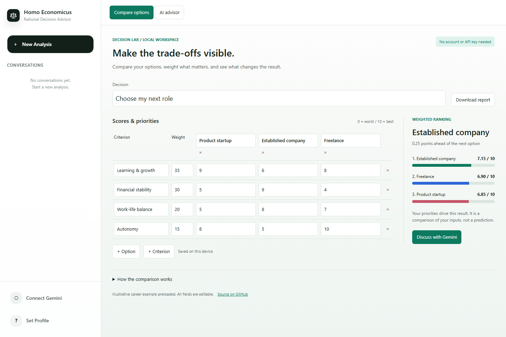

# Homo Economicus

A local-first decision workspace: compare options with transparent weighted scoring, then challenge your assumptions with a streaming Gemini advisor.

[Open the live app](https://k-karthik-pai.github.io/Homo-economicus/) | [Windows releases](https://github.com/k-karthik-pai/Homo-economicus/releases/latest) | [Build status](https://github.com/k-karthik-pai/Homo-economicus/actions/workflows/pages.yml)

## Try it in a minute

1. Open the live app. An editable career decision is already loaded; no account or key is required.
2. Change the priorities or scores. Rankings update immediately and persist on this device.
3. Download a Markdown report, or choose **Discuss with Gemini** to prepare the comparison for the AI advisor.
4. For AI responses, connect your own [Gemini API key](https://aistudio.google.com/app/apikey) and submit the prepared message. No shared API key is shipped with the application.



## Features

- Compare 2-5 options across 1-8 criteria, with editable weights and scores.
- Normalize weights automatically, identify ties, and see the margin between top options.
- Keep the matrix, chat history, and optional display profile on the current device.
- Export comparisons and conversations as Markdown.
- Stream Gemini responses with decision-theory badges, cancellation, timeouts, and fallback on eligible server/model errors.
- Preserve partial answers after cancellation or network failure. Restore deleted conversations with Undo.
- Run in a modern browser or as a Windows 10/11 x64 desktop application.

## Architecture

JavaScript modules and CSS form the UI, built with Vite. A pure calculation module owns validation, normalized scoring, ranking, and report generation. `DecisionWorkspace` handles editing; `ChatEngine` owns conversation state and persistence; the Gemini transport consumes SSE incrementally. Electron shares the production web build and exposes a minimal encrypted-key bridge.

```text
Decision workspace -> matrix.js -> ranking + Markdown report
                   -> prepared prompt -> ChatEngine -> Gemini SSE
                                              |
                                         local history
Windows shell -> isolated preload -> safeStorage-encrypted API key
```

The score is `sum(weight * score) / sum(weights)`, on a 0-10 scale. Higher scores mean better outcomes, including lower cost or lower risk. Zero-weight criteria are excluded; all-zero weights produce no ranking. This additive model assumes independent criteria and subjective input scores. Rankings are not forecasts or validated recommendations. Gemini provides qualitative discussion, not a guarantee of correctness or professional advice.

## Development

Requires Node.js 22.12+ and npm. End users do not need Node.js.

```sh
npm ci
npm run dev
npm run verify
npx playwright install chromium
npm run test:browser
```

`verify` runs transport/state smoke checks, calculation and failure-path tests, then a production build. Browser tests exercise desktop/mobile persistence, export, AI handoff, mocked streaming, HTML escaping, and deletion recovery. They intercept Gemini traffic, so they do not spend API credits or certify a real user's key.

```sh
npm run desktop          # Windows shell from source
npm run desktop:pack     # unpacked Windows app
npm run desktop:dist     # installer and portable ZIP in release/
```

## Deployment

Pushing to `main` runs verification and browser tests in GitHub Actions, then deploys `dist/` to GitHub Pages. Pull requests run checks without deploying. Relative asset paths support both the repository URL and Electron's local file loader.

Version tags such as `v1.1.0` run Windows packaging and attach the installer and ZIP to a GitHub Release. Generated files are excluded from source control. The installer is unsigned and may trigger Windows SmartScreen.

In a fork, enable **Settings > Pages > GitHub Actions**, then push to `main`. No hosting secrets, database, or paid server is required. Other static hosts can publish `dist/` after `npm run build`.

## Privacy and limitations

- Calculations run locally. The preloaded example is illustrative data, not AI output.
- Submitted messages and up to 24 recent messages go directly to Google with the system prompt. Google API quotas and terms apply.
- Browser keys are stored in that browser's local storage. Use a personal browser profile and clear the key in Gemini Settings when finished.
- Windows keys use Electron `safeStorage`. The isolated renderer has no Node.js access; external navigation and permissions are restricted.
- Reports contain decision text but no API keys. There is no analytics, application server, cloud synchronization, or real account system.
- Clearing site data removes local work. Export anything you need to retain. API availability and model retirement remain external dependencies; comparisons work independently of Gemini.

## Portfolio description

Built and deployed a local-first decision-support application with an interactive weighted decision matrix, streaming Gemini integration, persistent conversations, Markdown exports, and a Windows Electron client. Added automated calculation, failure-path, and desktop/mobile browser tests, with GitHub Actions deployment and tagged desktop releases.

This describes implemented features; no user-adoption or accuracy claims are implied.

## Source map

| Path | Responsibility |
| --- | --- |
| `src/decision/` | Pure scoring, validation and report logic |
| `src/components/` | Comparison editor, sidebar, settings and composer |
| `src/chat/` | Conversation lifecycle and safe message rendering |
| `src/api/` | Gemini streaming transport and system prompt |
| `electron/` | Windows shell and encrypted key bridge |
| `tests/` | Unit tests and desktop/mobile browser tests |
| `.github/workflows/` | Web deployment and Windows releases |

MIT licensed. See [LICENSE](LICENSE).
